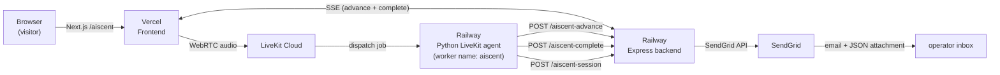

# AiSCENT — CX Maturity Interviewer (standalone)

A short, voice-only interviewer that assesses customer-experience maturity
across six camps (A / I / S / C / E / N) and produces a personalised
Ascent Position for the participant.

This is the standalone version of AiSCENT — everything it needs to run in
its own repo, on its own hosts, with no shared database.

## Architecture




Three services, all deploy from this repo:

- `frontend/` — Next.js 15 app. Renders the interview UI, mints the
LiveKit JWT server-side, consumes SSE from the backend. Deploy to
Vercel.
- `backend/` — Express server. SSE bridge for the `advance` and
`complete` events, and receives the final interview JSON, which it
forwards to SendGrid as an email with the JSON attached. Deploy to
Railway (or any Node host).
- `agent/` — Python LiveKit worker. Registers as `aiscent`. Runs the
interview end-to-end, records camp scores via LLM tool calls, generates
the Ascent Position narrative, then POSTs everything to the backend.
Deploy to Railway via the included `Dockerfile`.

The `test-scripts/` folder contains the QA scripts you use to validate  
the deployment — see especially `aiscent_test_script_simplified.md` for  
a quick Pre-Climb walkthrough.

## Local development

Run each service in its own terminal. The order shown here (agent →
backend → frontend) is the order they need each other's URLs.

### Agent

```bash
cd agent
python3 -m venv .venv
source .venv/bin/activate
pip install -r requirements.txt
cp .env.example .env      # fill in the values inside .env
python main.py dev        # LiveKit dev mode
```

You should see `registered worker` in the log within a few seconds.

### Backend

```bash
cd backend
npm install
cp .env.example .env      # fill in the values inside .env
npm start
```

Visit `http://localhost:3000/` — you should see the health JSON.

### Frontend

```bash
cd frontend
npm install
cp .env.example .env.local  # fill in the values
npm run dev
```

Open `http://localhost:3000` (or whichever port Next.js prints — if the
backend has claimed 3000, run `npm run dev -- --port 3001`). You'll be
redirected to `/aiscent`.

### End-to-end smoke test

Follow `test-scripts/aiscent_test_script_simplified.md`. If the closing  
sentence plays fully and the "Ascent Position" screen renders, and an  
email arrives at `AISCENT_RESULTS_EMAIL_TO`, everything is wired.

